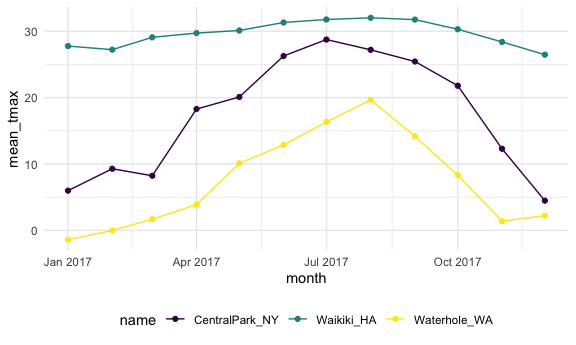
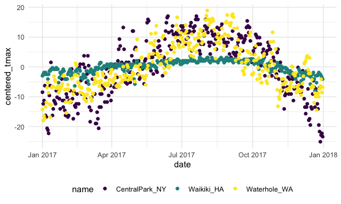

Group by and summarize
================

``` r
library(tidyverse)

#set the figures' size
knitr::opts_chunk$set(
  fig.width = 6,
  fig.asp = .6,
  out.width = "90%"
)

#set the theme of all graphs
theme_set(theme_minimal() + theme(legend.position = "bottom"))

#set color of all graphs
options(
  ggplot2.continuous.colour = "viridis", #color 边界
  ggplot2.continuous.fill = "viridis" #color 填充
)

scale_colour_discrete = scale_colour_viridis_d
scale_fill_discrete = scale_fill_viridis_d
```

Load the weather dataset

``` r
weather_df =  
  rnoaa::meteo_pull_monitors(
    c("USW00094728", "USC00519397", "USS0023B17S"),
    var = c("PRCP", "TMIN", "TMAX"), 
    date_min = "2017-01-01",
    date_max = "2017-12-31") %>%
  mutate(
    name = recode( #add a new variable named `name` and match with the `id`
      id, 
      USW00094728 = "CentralPark_NY", 
      USC00519397 = "Waikiki_HA",
      USS0023B17S = "Waterhole_WA"),
    tmin = tmin / 10,
    tmax = tmax / 10,
    month = lubridate::floor_date(date, unit = "month")) %>% #Add a new variable to describe the "month" variable rounding the date to the nearest month.
  select(name, id, everything())
```

    ## Registered S3 method overwritten by 'hoardr':
    ##   method           from
    ##   print.cache_info httr

    ## using cached file: ~/Library/Caches/R/noaa_ghcnd/USW00094728.dly

    ## date created (size, mb): 2021-10-05 10:31:49 (7.602)

    ## file min/max dates: 1869-01-01 / 2021-10-31

    ## using cached file: ~/Library/Caches/R/noaa_ghcnd/USC00519397.dly

    ## date created (size, mb): 2021-10-05 10:31:56 (1.697)

    ## file min/max dates: 1965-01-01 / 2020-02-29

    ## using cached file: ~/Library/Caches/R/noaa_ghcnd/USS0023B17S.dly

    ## date created (size, mb): 2021-10-05 10:31:59 (0.912)

    ## file min/max dates: 1999-09-01 / 2021-09-30

### `group_by()`

``` r
weather_df %>% 
  group_by(name, month) %>% #group name and month
  ungroup(month) #ungroup month
```

    ## # A tibble: 1,095 × 7
    ## # Groups:   name [3]
    ##    name           id          date        prcp  tmax  tmin month     
    ##    <chr>          <chr>       <date>     <dbl> <dbl> <dbl> <date>    
    ##  1 CentralPark_NY USW00094728 2017-01-01     0   8.9   4.4 2017-01-01
    ##  2 CentralPark_NY USW00094728 2017-01-02    53   5     2.8 2017-01-01
    ##  3 CentralPark_NY USW00094728 2017-01-03   147   6.1   3.9 2017-01-01
    ##  4 CentralPark_NY USW00094728 2017-01-04     0  11.1   1.1 2017-01-01
    ##  5 CentralPark_NY USW00094728 2017-01-05     0   1.1  -2.7 2017-01-01
    ##  6 CentralPark_NY USW00094728 2017-01-06    13   0.6  -3.8 2017-01-01
    ##  7 CentralPark_NY USW00094728 2017-01-07    81  -3.2  -6.6 2017-01-01
    ##  8 CentralPark_NY USW00094728 2017-01-08     0  -3.8  -8.8 2017-01-01
    ##  9 CentralPark_NY USW00094728 2017-01-09     0  -4.9  -9.9 2017-01-01
    ## 10 CentralPark_NY USW00094728 2017-01-10     0   7.8  -6   2017-01-01
    ## # … with 1,085 more rows

### Counting things

-   How many observations in …?

1.  `group_by` first, them `summaarize()`

``` r
#Count month observations:
weather_df %>% 
  group_by(month) %>% #group by month
  summarize(n_obs = n()) #`n()`: how many observations in current group!
```

    ## # A tibble: 12 × 2
    ##    month      n_obs
    ##    <date>     <int>
    ##  1 2017-01-01    93
    ##  2 2017-02-01    84
    ##  3 2017-03-01    93
    ##  4 2017-04-01    90
    ##  5 2017-05-01    93
    ##  6 2017-06-01    90
    ##  7 2017-07-01    93
    ##  8 2017-08-01    93
    ##  9 2017-09-01    90
    ## 10 2017-10-01    93
    ## 11 2017-11-01    90
    ## 12 2017-12-01    93

``` r
weather_df %>% 
  group_by(name, month) %>% #group by name and month
  summarize(n_obs = n()) # how many observations in current group!
```

    ## `summarise()` has grouped output by 'name'. You can override using the `.groups` argument.

    ## # A tibble: 36 × 3
    ## # Groups:   name [3]
    ##    name           month      n_obs
    ##    <chr>          <date>     <int>
    ##  1 CentralPark_NY 2017-01-01    31
    ##  2 CentralPark_NY 2017-02-01    28
    ##  3 CentralPark_NY 2017-03-01    31
    ##  4 CentralPark_NY 2017-04-01    30
    ##  5 CentralPark_NY 2017-05-01    31
    ##  6 CentralPark_NY 2017-06-01    30
    ##  7 CentralPark_NY 2017-07-01    31
    ##  8 CentralPark_NY 2017-08-01    31
    ##  9 CentralPark_NY 2017-09-01    30
    ## 10 CentralPark_NY 2017-10-01    31
    ## # … with 26 more rows

OR:

2.  `count()`

``` r
weather_df %>% 
  count(name, month, name = "n_obs") #count the name and month (similar as groupby and summarize)
```

    ## # A tibble: 36 × 3
    ##    name           month      n_obs
    ##    <chr>          <date>     <int>
    ##  1 CentralPark_NY 2017-01-01    31
    ##  2 CentralPark_NY 2017-02-01    28
    ##  3 CentralPark_NY 2017-03-01    31
    ##  4 CentralPark_NY 2017-04-01    30
    ##  5 CentralPark_NY 2017-05-01    31
    ##  6 CentralPark_NY 2017-06-01    30
    ##  7 CentralPark_NY 2017-07-01    31
    ##  8 CentralPark_NY 2017-08-01    31
    ##  9 CentralPark_NY 2017-09-01    30
    ## 10 CentralPark_NY 2017-10-01    31
    ## # … with 26 more rows

### Creating 2x2 tables:

1.  

-   Summarize produces is a data frame, so we can make plots.
-   **Never** use base R’s `table` function, since it produces data
    frame that cannot do anything on.

``` r
#never use!
weather_df %>% 
  pull(name) %>% 
  table()
```

    ## .
    ## CentralPark_NY     Waikiki_HA   Waterhole_WA 
    ##            365            365            365

2.  creating 2x2 tables (2ways): (a) and (b) produce the same things!

``` r
#a)
weather_df %>% 
  janitor::tabyl(month, name)
```

    ##       month CentralPark_NY Waikiki_HA Waterhole_WA
    ##  2017-01-01             31         31           31
    ##  2017-02-01             28         28           28
    ##  2017-03-01             31         31           31
    ##  2017-04-01             30         30           30
    ##  2017-05-01             31         31           31
    ##  2017-06-01             30         30           30
    ##  2017-07-01             31         31           31
    ##  2017-08-01             31         31           31
    ##  2017-09-01             30         30           30
    ##  2017-10-01             31         31           31
    ##  2017-11-01             30         30           30
    ##  2017-12-01             31         31           31

``` r
#b)
weather_df %>% 
  group_by(name, month) %>% #group by name
  summarize(n_obs = n()) # how many observations in each name and month
```

    ## `summarise()` has grouped output by 'name'. You can override using the `.groups` argument.

    ## # A tibble: 36 × 3
    ## # Groups:   name [3]
    ##    name           month      n_obs
    ##    <chr>          <date>     <int>
    ##  1 CentralPark_NY 2017-01-01    31
    ##  2 CentralPark_NY 2017-02-01    28
    ##  3 CentralPark_NY 2017-03-01    31
    ##  4 CentralPark_NY 2017-04-01    30
    ##  5 CentralPark_NY 2017-05-01    31
    ##  6 CentralPark_NY 2017-06-01    30
    ##  7 CentralPark_NY 2017-07-01    31
    ##  8 CentralPark_NY 2017-08-01    31
    ##  9 CentralPark_NY 2017-09-01    30
    ## 10 CentralPark_NY 2017-10-01    31
    ## # … with 26 more rows

``` r
weather_df %>% 
  group_by(month) %>% 
  summarize(
    n_obs = n(),
    n_days = n_distinct(date)) #show number of distinct values of date in each month.
```

    ## # A tibble: 12 × 3
    ##    month      n_obs n_days
    ##    <date>     <int>  <int>
    ##  1 2017-01-01    93     31
    ##  2 2017-02-01    84     28
    ##  3 2017-03-01    93     31
    ##  4 2017-04-01    90     30
    ##  5 2017-05-01    93     31
    ##  6 2017-06-01    90     30
    ##  7 2017-07-01    93     31
    ##  8 2017-08-01    93     31
    ##  9 2017-09-01    90     30
    ## 10 2017-10-01    93     31
    ## 11 2017-11-01    90     30
    ## 12 2017-12-01    93     31

3.  

``` r
weather_df %>% 
  filter(name != "Waikiki_HA") %>% 
  mutate(
    cold = case_when( #IF, THEN function!
      tmax < 5 ~ "cold", # if tmax < 5, then "cold" variable will print "cold"
      tmax >=5 ~ "not_cold",  # if tmax >= 5, then "cold" variable will print "not_cold"
      TRUE      ~ "" #otherwise, ...?
    )
  ) %>% 
  group_by(name,cold) %>% 
  summarize(count = n())
```

    ## `summarise()` has grouped output by 'name'. You can override using the `.groups` argument.

    ## # A tibble: 4 × 3
    ## # Groups:   name [2]
    ##   name           cold     count
    ##   <chr>          <chr>    <int>
    ## 1 CentralPark_NY cold        44
    ## 2 CentralPark_NY not_cold   321
    ## 3 Waterhole_WA   cold       172
    ## 4 Waterhole_WA   not_cold   193

``` r
#OR

weather_df %>% 
  filter(name != "Waikiki_HA") %>% 
  mutate(
    cold = case_when( #IF, THEN function!
      tmax < 5 ~ "cold", # if tmax < 5, then "cold" variable will print "cold"
      tmax >=5 ~ "not_cold",  # if tmax >= 5, then "cold" variable will print "not_cold"
      TRUE      ~ "" #otherwise, ...?
    )
  ) %>% 
  janitor::tabyl(name, cold)
```

    ##            name cold not_cold
    ##  CentralPark_NY   44      321
    ##    Waterhole_WA  172      193

4.  Formatting table outputs

``` r
weather_df %>% 
  group_by(name) %>% 
  summarize(
    n_obs = n(),
    mean_tmax = mean(tmax, na.rm = TRUE) #only show the summarized variables
  ) %>% 
  knitr::kable(digits = 2) #make table with 2 sigfits
```

| name            | n\_obs | mean\_tmax |
|:----------------|-------:|-----------:|
| CentralPark\_NY |    365 |      17.37 |
| Waikiki\_HA     |    365 |      29.66 |
| Waterhole\_WA   |    365 |       7.48 |

### General summaries

1.  use the produced dataframe to plot ggplot

``` r
weather_df %>% 
  group_by(name, month) %>% 
  summarize(
    n_obs = n(),
    mean_tmax = mean(tmax, na.rm = TRUE), #drop missing values in tmax variables,
    median_tmax = median(tmax, na.rm = TRUE),
    sd_tmax = sd(tmax, na.rm = TRUE)
  ) %>% 
  ggplot(aes(x = month, y = mean_tmax, color = name)) + 
  geom_point() + 
  geom_line()
```

    ## `summarise()` has grouped output by 'name'. You can override using the `.groups` argument.



2.  Summarize many columns:

``` r
weather_df %>% 
  group_by(name, month) %>% 
  summarize(across(prcp:tmin, mean)) #mean of variables from prcp to tmin (use across to summarize many columns by using same function)
```

    ## `summarise()` has grouped output by 'name'. You can override using the `.groups` argument.

    ## # A tibble: 36 × 5
    ## # Groups:   name [3]
    ##    name           month       prcp  tmax   tmin
    ##    <chr>          <date>     <dbl> <dbl>  <dbl>
    ##  1 CentralPark_NY 2017-01-01  39.5  5.98  0.748
    ##  2 CentralPark_NY 2017-02-01  22.5  9.28  1.45 
    ##  3 CentralPark_NY 2017-03-01  43.0  8.22 -0.177
    ##  4 CentralPark_NY 2017-04-01  32.5 18.3   9.66 
    ##  5 CentralPark_NY 2017-05-01  52.3 20.1  12.2  
    ##  6 CentralPark_NY 2017-06-01  40.4 26.3  18.2  
    ##  7 CentralPark_NY 2017-07-01  34.3 28.7  21.0  
    ##  8 CentralPark_NY 2017-08-01  27.4 27.2  19.5  
    ##  9 CentralPark_NY 2017-09-01  17.0 25.4  17.4  
    ## 10 CentralPark_NY 2017-10-01  34.3 21.8  13.9  
    ## # … with 26 more rows

3.  Make results easier to read:

``` r
weather_df %>% 
  group_by(name, month) %>% 
  summarize(mean_tmax = mean(tmax)) %>% 
  pivot_wider(
    names_from = name,
    values_from = mean_tmax
  ) %>% 
  knitr::kable(digits = 1) #1 sigfit
```

    ## `summarise()` has grouped output by 'name'. You can override using the `.groups` argument.

| month      | CentralPark\_NY | Waikiki\_HA | Waterhole\_WA |
|:-----------|----------------:|------------:|--------------:|
| 2017-01-01 |             6.0 |        27.8 |          -1.4 |
| 2017-02-01 |             9.3 |        27.2 |           0.0 |
| 2017-03-01 |             8.2 |        29.1 |           1.7 |
| 2017-04-01 |            18.3 |        29.7 |           3.9 |
| 2017-05-01 |            20.1 |          NA |          10.1 |
| 2017-06-01 |            26.3 |        31.3 |          12.9 |
| 2017-07-01 |            28.7 |          NA |          16.3 |
| 2017-08-01 |            27.2 |        32.0 |          19.6 |
| 2017-09-01 |            25.4 |        31.7 |          14.2 |
| 2017-10-01 |            21.8 |        30.3 |           8.3 |
| 2017-11-01 |            12.3 |        28.4 |           1.4 |
| 2017-12-01 |             4.5 |        26.5 |           2.2 |

### `group_by` and `mutated`

-   for example: so we can calculate the mean based on the group
    (calculate the mean for one group first, and so on)

1.  

``` r
weather_df %>% 
  group_by(name) %>% 
  mutate(
    mean_tmax = mean(tmax, na.rm = TRUE), #adding a variable for mean_tmax
    centered_tmax = tmax - mean_tmax
  ) %>% 
  ggplot(aes(x = date, y = centered_tmax, color = name)) +
  geom_point()
```

    ## Warning: Removed 3 rows containing missing values (geom_point).



2.  ranking function

``` r
weather_df %>% 
  group_by(name) %>% 
  mutate(
    tmax_rank = min_rank(desc(tmax)) #rank tmax largest to lowest; no desc() then from lowest to largest
  ) %>% 
  filter(tmax_rank == 1) #filter the hottest day
```

    ## # A tibble: 4 × 8
    ## # Groups:   name [3]
    ##   name           id          date        prcp  tmax  tmin month      tmax_rank
    ##   <chr>          <chr>       <date>     <dbl> <dbl> <dbl> <date>         <int>
    ## 1 CentralPark_NY USW00094728 2017-06-13     0  34.4  25   2017-06-01         1
    ## 2 CentralPark_NY USW00094728 2017-07-20     3  34.4  25   2017-07-01         1
    ## 3 Waikiki_HA     USC00519397 2017-07-12     0  33.3  24.4 2017-07-01         1
    ## 4 Waterhole_WA   USS0023B17S 2017-08-03     0  26.4  13.3 2017-08-01         1

3.  Lagged function

-   “compute day to day temperature variability”

``` r
weather_df %>% 
  group_by(name) %>% 
  mutate(
    lagged_tmax = lag(tmax, n = 1), #show what is the tmax 1 day before (since n = 1), so the table shows the tmax for today and the day before
    tmax_diff = tmax - lagged_tmax
  ) %>% 
  summarize(
    diff_sd = sd(tmax_diff, na.rm = TRUE),
    diff_max = max(tmax_diff, na.rm = TRUE) )
```

    ## # A tibble: 3 × 3
    ##   name           diff_sd diff_max
    ##   <chr>            <dbl>    <dbl>
    ## 1 CentralPark_NY    4.45     12.7
    ## 2 Waikiki_HA        1.23      6.7
    ## 3 Waterhole_WA      3.13      8

### Limitations

what if my “summary” is a linear model… Unable to do it.

``` r
weather_df %>% 
  group_by(name) %>% 
  summarize(cor_tmin_tmax = cor(tmin, tmax, use = "complete")) #calculate the correlation btw tmax and tmin
```

    ## # A tibble: 3 × 2
    ##   name           cor_tmin_tmax
    ##   <chr>                  <dbl>
    ## 1 CentralPark_NY         0.955
    ## 2 Waikiki_HA             0.638
    ## 3 Waterhole_WA           0.939

``` r
weather_df %>% 
  filter(name == "CentralPark_NY") %>% 
  lm(tmax ~ tmin, data = .) #make a linear equation by tmax and tmin, by using this dataset, weather_df
```

    ## 
    ## Call:
    ## lm(formula = tmax ~ tmin, data = .)
    ## 
    ## Coefficients:
    ## (Intercept)         tmin  
    ##       7.209        1.039

``` r
#unable to do 
# weather_df %>% 
  # group_by(name) %>% 
  # summarize(lm = lm(tmax ~ tmin))
```
