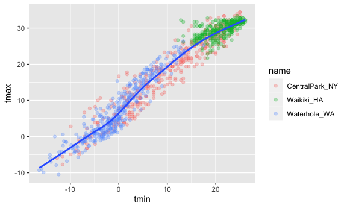
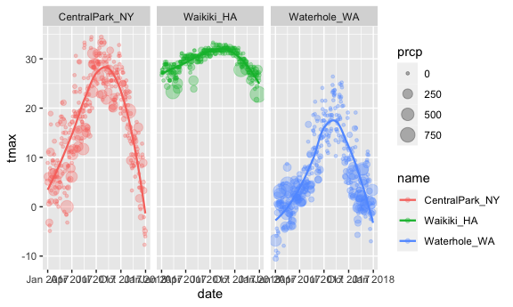
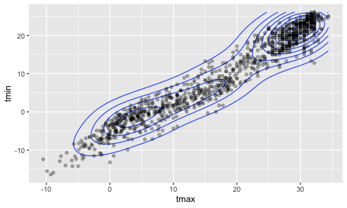
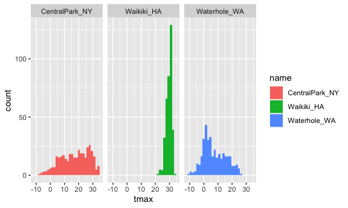
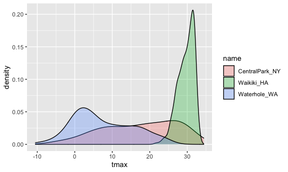
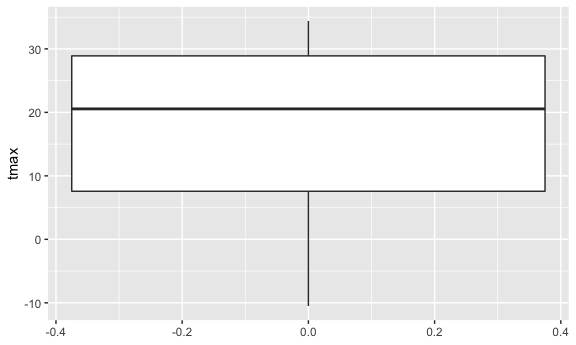
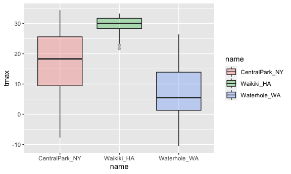
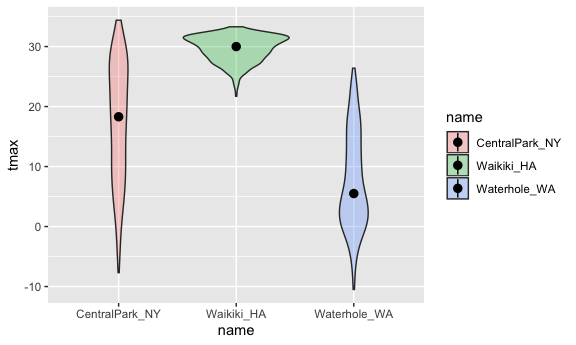

visualization\_ggplot2
================

load in a dataset that we will use often.

``` r
library(tidyverse)
# library(ggridges)

knitr::opts_chunk$set(
  fig.width = 6,
  fig.asp = 0.6,
  out.width = "90%"
)
```

``` r
weather_df = 
  rnoaa::meteo_pull_monitors(             #download NOAA weather data, pull data names c, var, and date
    c("USW00094728", "USC00519397", "USS0023B17S"),
    var = c("PRCP", "TMIN", "TMAX"), 
    date_min = "2017-01-01",
    date_max = "2017-12-31") %>%
  mutate(
    name = recode(
      id, 
      USW00094728 = "CentralPark_NY", 
      USC00519397 = "Waikiki_HA",
      USS0023B17S = "Waterhole_WA"),
    tmin = tmin / 10,
    tmax = tmax / 10) %>%
  select(name, id, everything())
```

    ## Registered S3 method overwritten by 'hoardr':
    ##   method           from
    ##   print.cache_info httr

    ## using cached file: ~/Library/Caches/R/noaa_ghcnd/USW00094728.dly

    ## date created (size, mb): 2021-10-05 10:31:49 (7.602)

    ## file min/max dates: 1869-01-01 / 2021-10-31

    ## using cached file: ~/Library/Caches/R/noaa_ghcnd/USC00519397.dly

    ## date created (size, mb): 2021-10-05 10:31:56 (1.697)

    ## file min/max dates: 1965-01-01 / 2020-02-29

    ## using cached file: ~/Library/Caches/R/noaa_ghcnd/USS0023B17S.dly

    ## date created (size, mb): 2021-10-05 10:31:59 (0.912)

    ## file min/max dates: 1999-09-01 / 2021-09-30

### Scatterplot:

1.  scatterplot: tmax vs tmin

``` r
weather_df %>% 
  ggplot(aes(x = tmin, y = tmax)) + 
  geom_point()
```

    ## Warning: Removed 15 rows containing missing values (geom_point).


``` r
# or

ggplot(weather_df, aes(x = tmin, y = tmax)) +
  geom_point()
```

    ## Warning: Removed 15 rows containing missing values (geom_point).


1.  save the ggplots and can print later

``` r
ggp_tmax_tmin = 
  weather_df %>% 
  ggplot(aes(x = tmin, y = tmax)) +
  geom_point()

ggp_tmax_tmin
```

    ## Warning: Removed 15 rows containing missing values (geom_point).


``` r
#or

ggp_tmax_tmin = 
  weather_df %>% 
  ggplot(aes(x = tmin, y = tmax))

ggp_tmax_tmin +  geom_point()
```

    ## Warning: Removed 15 rows containing missing values (geom_point).


2.  Add color/ smooth curves/ other stuff

-   se: put confidence interval around the plot (se = FALSE): exclude
    standard error bar of confidence interval
-   alpha = .3: transparency of color of the points

``` r
weather_df %>% 
  ggplot(aes(x = tmin, y = tmax, color = name)) + #color all ggplots based on names 
  geom_point(alpha = 0.3) + 
  geom_smooth(se = FALSE) + #draw the smooth curves in the middle of dataset, and exclude standard error bar of confidence interval
  facet_grid(. ~ name) #multi-panel graphs: separate the plot based on variable `name`
```

    ## `geom_smooth()` using method = 'loess' and formula 'y ~ x'

    ## Warning: Removed 15 rows containing non-finite values (stat_smooth).

    ## Warning: Removed 15 rows containing missing values (geom_point).


``` r
weather_df %>% 
  ggplot(aes(x = tmin, y = tmax)) +
  geom_point(aes(color = name), alpha = 0.3) +  #only color the scatterplot based on names 
  geom_smooth(se = FALSE) #since only color the scatterplot, only show one smooth curve based on entire data
```

    ## `geom_smooth()` using method = 'gam' and formula 'y ~ s(x, bs = "cs")'

    ## Warning: Removed 15 rows containing non-finite values (stat_smooth).

    ## Warning: Removed 15 rows containing missing values (geom_point).



1.  Make more scatterplots

``` r
weather_df %>% 
  ggplot(aes(x = date, y = tmax, color = name, size = prcp)) + #let the size of plots based on prcp's value (larger prcp value, larger point)
  geom_point(alpha = .3) +
  facet_grid(. ~ name) +
  geom_smooth(se = FALSE, size = 0.8)
```

    ## `geom_smooth()` using method = 'loess' and formula 'y ~ x'

    ## Warning: Removed 3 rows containing non-finite values (stat_smooth).

    ## Warning: Removed 3 rows containing missing values (geom_point).



### Use data manipulation as a part of this

``` r
weather_df %>% 
  filter(name == "CentralPark_NY") %>% 
  mutate(
    tmax = tmax * (9/5) + 32,
    tmin = tmin * (9/5) + 32
  ) %>% 
  ggplot(aes(x = tmin, y = tmax)) +
  geom_point()
```


### Stacking geoms

which geoms do you want?

1.  Draw smooth curve without scatterplot

``` r
weather_df %>% 
  ggplot(aes(x = date, y = tmax, color = name)) +
  geom_smooth()
```

    ## `geom_smooth()` using method = 'loess' and formula 'y ~ x'

    ## Warning: Removed 3 rows containing non-finite values (stat_smooth).


2.  give density of data (neat geom!)

``` r
weather_df %>% 
  ggplot(aes(x = tmax, y = tmin)) + 
  geom_hex()
```

    ## Warning: Removed 15 rows containing non-finite values (stat_binhex).


``` r
weather_df %>% 
  ggplot(aes(x = tmax, y = tmin)) + 
  geom_density2d() +
  geom_point(alpha = .3)
```

    ## Warning: Removed 15 rows containing non-finite values (stat_density2d).

    ## Warning: Removed 15 rows containing missing values (geom_point).



### Univariate plots

# Everything before ggplot use pipe, %&gt;%; Everything after ggplot use plus, +.

1.  Histogram

``` r
weather_df %>% 
  ggplot(aes(x = tmax, fill = name)) + # fill = name, fill the color of histogram bars based on diff names.
  geom_histogram() +
  facet_grid(. ~ name) # separate one plot to separate plots based on names (.~ nmaes: 1 rows, multiple columns)
```

    ## `stat_bin()` using `bins = 30`. Pick better value with `binwidth`.

    ## Warning: Removed 3 rows containing non-finite values (stat_bin).



2.  Density plot: smoothed down the histogram (easier to compare, but
    loose some data)

``` r
weather_df %>% 
  ggplot(aes(x = tmax, fill = name)) +
  geom_density(alpha = .3) #color's transparency of density plots is 0.3
```

    ## Warning: Removed 3 rows containing non-finite values (stat_density).



3.  Boxplot

``` r
weather_df %>% 
  ggplot(aes(y = tmax)) + #one boxplots of tmax values
  geom_boxplot()
```

    ## Warning: Removed 3 rows containing non-finite values (stat_boxplot).



``` r
weather_df %>% 
  ggplot(aes(x = name, y = tmax, fill = name)) + #draw multiple boxplots based on names
  geom_boxplot(alpha = 0.3)
```

    ## Warning: Removed 3 rows containing non-finite values (stat_boxplot).



4.  Trendy plot: violin plots :-)

``` r
weather_df %>% 
  ggplot(aes(x = name, y = tmax, fill = name)) +
  geom_violin(alpha = 0.3) +
  stat_summary(fun = "median") #give the point of median
```

    ## Warning: Removed 3 rows containing non-finite values (stat_ydensity).

    ## Warning: Removed 3 rows containing non-finite values (stat_summary).

    ## Warning: Removed 3 rows containing missing values (geom_segment).



5.  Ridge plots

``` r
library(ggridges)

weather_df %>% 
  ggplot(aes(x = tmax, y = name)) +
  geom_density_ridges(alpha = .8, scale = .8) #multiple density curves based on different names
```

    ## Picking joint bandwidth of 1.84

    ## Warning: Removed 3 rows containing non-finite values (stat_density_ridges).


-   color = name vs. fill = name:  
    color = name: color the outline  
    fill = name: fill the color in the graph

### Save and Embed plots

1.  Save a scatterplot

``` r
weather_plot = 
weather_df %>% 
  ggplot(aes(x = tmin, y = tmax, color = name)) + #aes(color = name), since it is aesthetic change.
  geom_point(alpha = .3)

ggsave("weather_plot.pdf", weather_plot, width = 8, height = 5) #save the plot `weather_plot` as the name "weather_plot.pdf", with specific size
```

    ## Warning: Removed 15 rows containing missing values (geom_point).

2.  Embedding

``` r
#make the figure 12x7

weather_df %>% 
  ggplot(aes(x = tmin, y = tmax, color = name)) +
  geom_point(alpha = .3)
```

    ## Warning: Removed 15 rows containing missing values (geom_point).


