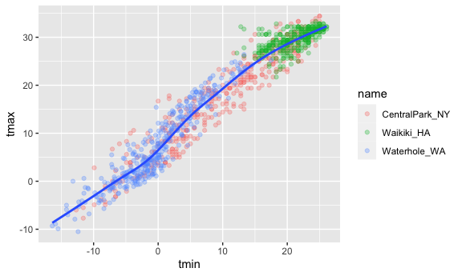
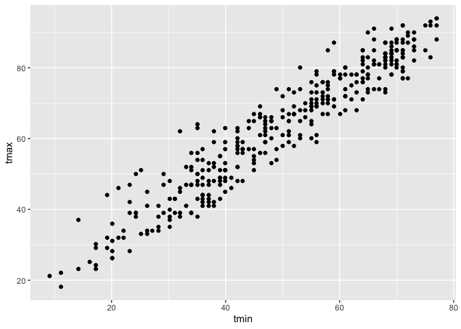
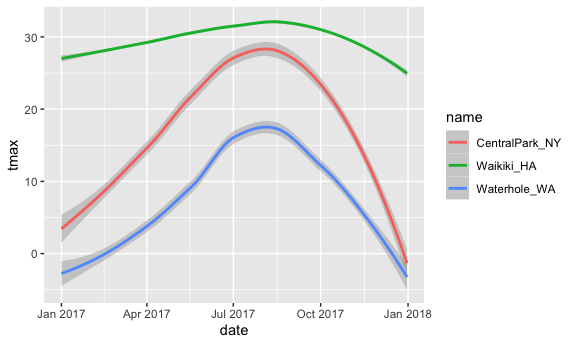
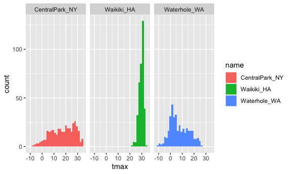
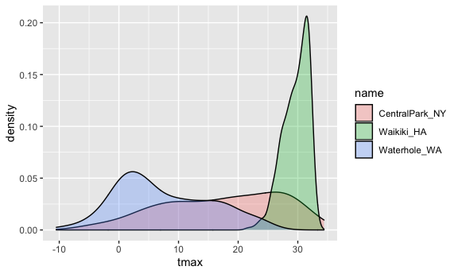
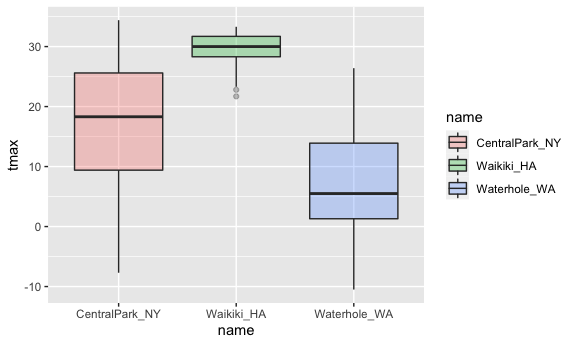
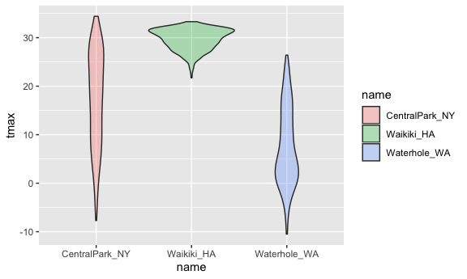
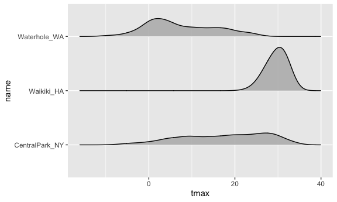
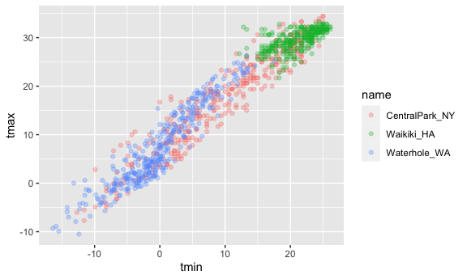
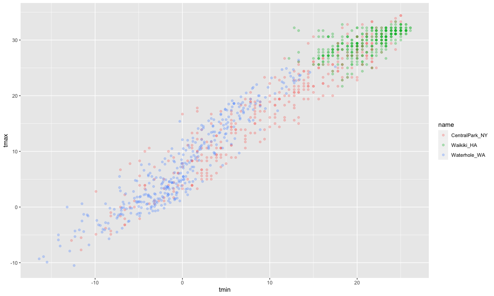

ggplot1
================

load in a dataset that we will use often.

``` r
library(tidyverse)
#library(ggridges)

knitr::opts_chunk$set(
  fig.width = 6,
  fig.asp = 0.6,
  out.width = "90%"
)
```

``` r
weather_df = 
  rnoaa::meteo_pull_monitors( # download NOAA weather data
    c("USW00094728", "USC00519397", "USS0023B17S"),
    var = c("PRCP", "TMIN", "TMAX"), 
    date_min = "2017-01-01",
    date_max = "2017-12-31") %>%
  mutate(
    name = recode(
      id, 
      USW00094728 = "CentralPark_NY", 
      USC00519397 = "Waikiki_HA",
      USS0023B17S = "Waterhole_WA"),
    tmin = tmin / 10,
    tmax = tmax / 10) %>%
  select(name, id, everything())
```

    ## Registered S3 method overwritten by 'hoardr':
    ##   method           from
    ##   print.cache_info httr

    ## using cached file: ~/Library/Caches/R/noaa_ghcnd/USW00094728.dly

    ## date created (size, mb): 2021-10-05 10:31:49 (7.602)

    ## file min/max dates: 1869-01-01 / 2021-10-31

    ## using cached file: ~/Library/Caches/R/noaa_ghcnd/USC00519397.dly

    ## date created (size, mb): 2021-10-05 10:31:56 (1.697)

    ## file min/max dates: 1965-01-01 / 2020-02-29

    ## using cached file: ~/Library/Caches/R/noaa_ghcnd/USS0023B17S.dly

    ## date created (size, mb): 2021-10-05 10:31:59 (0.912)

    ## file min/max dates: 1999-09-01 / 2021-09-30

### Scatterplot

1.  plot: tmax vs tmin

``` r
weather_df %>% 
  ggplot(aes(x = tmin, y = tmax)) +
  geom_point()
```

    ## Warning: Removed 15 rows containing missing values (geom_point).


1.  you can save ggplots

``` r
ggp_tmax_tmin = 
  weather_df %>% 
  ggplot(aes(x = tmin, y = tmax)) +
  geom_point()

ggp_tmax_tmin
```

    ## Warning: Removed 15 rows containing missing values (geom_point).


2.  Addcolor? lines? other stuff??

-   transparency of points made by this geom\_point() \#(aes(color =
    name)) in geom\_point() but not in ggplot() will

-   se: put confidence interval around the plot (se = FALSE): exclude
    standard error bar of confidence interval

-   alpha = .3: transparency

``` r
weather_df %>% 
  ggplot(aes(x = tmin, y = tmax)) +
  geom_point(aes(color = name), alpha = 0.3) + 
  geom_smooth(se = FALSE)
```

    ## `geom_smooth()` using method = 'gam' and formula 'y ~ s(x, bs = "cs")'

    ## Warning: Removed 15 rows containing non-finite values (stat_smooth).

    ## Warning: Removed 15 rows containing missing values (geom_point).



``` r
weather_df %>% 
  ggplot(aes(x = tmin, y = tmax, color = name)) +
  geom_point(alpha = 0.3) + 
  geom_smooth(se = FALSE) + #draw best fit line and exclude standard error bar of confidence interval
  facet_grid(. ~ name)
```

    ## `geom_smooth()` using method = 'loess' and formula 'y ~ x'

    ## Warning: Removed 15 rows containing non-finite values (stat_smooth).

    ## Warning: Removed 15 rows containing missing values (geom_point).


Make more scatterplots

``` r
weather_df %>% 
  ggplot(aes(x = date, y = tmax, size = prcp)) +
  geom_point(alpha = .3) +
  facet_grid(. ~ name) +
  geom_smooth(se = FALSE)
```

    ## `geom_smooth()` using method = 'loess' and formula 'y ~ x'

    ## Warning: Removed 3 rows containing non-finite values (stat_smooth).

    ## Warning: Removed 3 rows containing missing values (geom_point).


### Use data manipulation as a part of this

``` r
weather_df %>% 
  filter(name == "CentralPark_NY") %>% 
  mutate(
    tmax = tmax * (9/5) + 32,
    tmin = tmin * (9/5) + 32
  ) %>% 
  ggplot(aes(x = tmin, y = tmax)) +
  geom_point()
```



### Stacking geoms

which geoms do you want?

1.  Draw smooth curve without scatterpoints

``` r
weather_df %>% 
  ggplot(aes(x = date, y = tmax, color = name)) +
  geom_smooth()
```

    ## `geom_smooth()` using method = 'loess' and formula 'y ~ x'

    ## Warning: Removed 3 rows containing non-finite values (stat_smooth).



2.  geom\_hex(): give density of data

``` r
weather_df %>% 
  ggplot(aes(x = tmax, y = tmin)) + 
  geom_hex()
```

    ## Warning: Removed 15 rows containing non-finite values (stat_binhex).


### Univariate plots

# Everything beore ggplot use pipe, %&gt;%; Everything after ggplot use plus, +.

1.  Histogram

``` r
weather_df %>% 
  ggplot(aes(x = tmax, fill = name)) + # fill = name, fill the histogram based on diff names.
  geom_histogram() +
  facet_grid(. ~ name) # separate one plot to separate plots based on names
```

    ## `stat_bin()` using `bins = 30`. Pick better value with `binwidth`.

    ## Warning: Removed 3 rows containing non-finite values (stat_bin).



2.  Density plot

``` r
weather_df %>% 
  ggplot(aes(x = tmax, fill = name)) +
  geom_density(alpha = .3) #color's transparency of density plots is 0.3
```

    ## Warning: Removed 3 rows containing non-finite values (stat_density).



3.  Boxplot

``` r
weather_df %>% 
  ggplot(aes(x = name, y = tmax, fill = name)) +
  geom_boxplot(alpha = 0.3)
```

    ## Warning: Removed 3 rows containing non-finite values (stat_boxplot).


Some plots like violin plots??

``` r
weather_df %>% 
  ggplot(aes(x = name, y = tmax, fill = name)) +
  geom_violin(alpha = 0.3)
```

    ## Warning: Removed 3 rows containing non-finite values (stat_ydensity).



what about ridges….

``` r
library(ggridges)

weather_df %>% 
  ggplot(aes(x = tmax, y = name)) +
  geom_density_ridges(alpha = .8, scale = .8)
```

    ## Picking joint bandwidth of 1.84

    ## Warning: Removed 3 rows containing non-finite values (stat_density_ridges).



-   color = name vs. fill = name:

### Embedding plots

``` r
weather_df %>% 
  ggplot(aes(x = tmin, y = tmax, color = name)) +
  geom_point(alpha = .3)
```

    ## Warning: Removed 15 rows containing missing values (geom_point).



``` r
weather_df %>% 
  ggplot(aes(x = tmin, y = tmax, color = name)) +
  geom_point(alpha = .3)
```

    ## Warning: Removed 15 rows containing missing values (geom_point).


